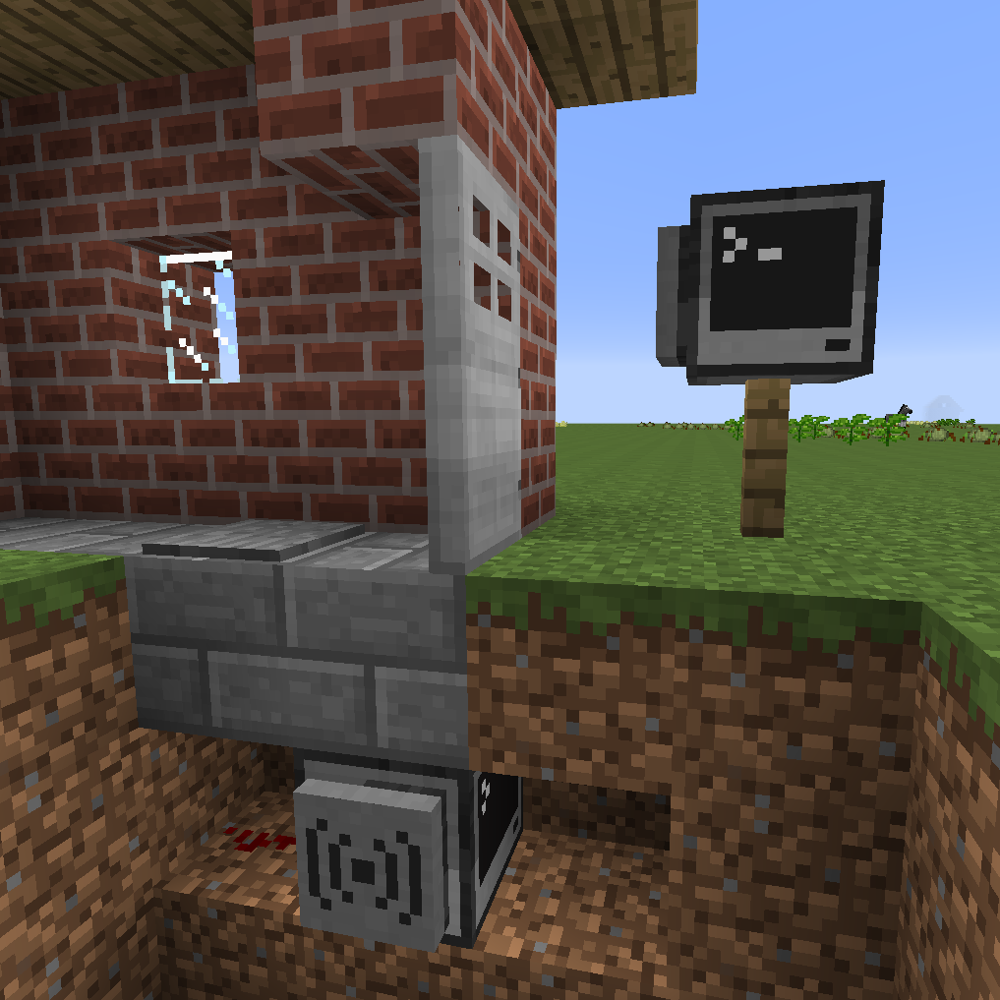

This example will show you how CryptoNet can be applied to a common application in ComputerCraft,
password locked doors. The user opens the door by entering a username and password on a client
machine next to the door. If they log in successfully, a server hidden below the door will open
the door, then close it again after the user has walked through. Since the server is buried in
the ground and the user can only interact directly with the client machine, the user cannot
simply close the program and turn on the redstone signal manually. CryptoNet's
secure hashed password storage and encrypted networking make it ideal for this task.



##### Client:
```lua
os.loadAPI("cryptoNet")

-- Ask the user for their username and password and send it to the server.
function enterDetails(socket)
  write("Name: ")
  local name = read()
  write("Password: ")
  local password = read("*")
  cryptoNet.login(socket, name, password)
  print("Logging in...")
  -- Now we wait for onEvent() to pick up the result.
end

-- Connect to the server when the program starts.
function onStart()
  print("Connecting...")
  local socket = cryptoNet.connect("CryptoDoor")
  print("Connected.")
  enterDetails(socket)
end

function onEvent(event)
  local msgType = event[1]
  -- The user logged in successfully, and the door has opened.
  if msgType == "login" then
    print("Welcome!")
  -- The user got the username or password wrong, so ask them to enter it again.
  elseif msgType == "login_failed" then
    print("Bad credentials. Go away!")
    local socket = event[3]
    enterDetails(socket)
  -- The user has been logged out by the server, which it does after the door
  -- has been closed. Prompt the user for their details again.
  elseif msgType == "logout" then
    print("Door closed.")
    local socket = event[3]
    enterDetails(socket)
  end
end

cryptoNet.setLoggingEnabled(false)
cryptoNet.startEventLoop(onStart, onEvent)
```

##### Server:
```lua
os.loadAPI("cryptoNet")
-- cryptoNet.setLoggingEnabled(false)

function onStart()
  -- Start the server
  cryptoNet.host("LoginDemoServer")
end

function onEvent(event)
os.loadAPI("cryptoNet")

function onEvent(event)
  -- Open the door when a user logs in successfully.
  if event[1] == "login" then
    print("Opening door...")
    -- Assume the door is above the computer.
    rs.setOutput("top", true)

    -- Wait for the user to walk over the pressure plate behind the door.
    while not rs.getInput("back") do
      os.pullEvent("redstone")
    end

    -- Close the door behind the user, then log out ready for the next person.
    rs.setOutput("top", false)
    print("Door closed.")
    cryptoNet.logout(event[3])
  end
end

function onStart()
  -- Set the server to not responsd to discovery requests for extra security.
  -- For extra security we could set hideCertificate to true and copy the .crt
  -- file to the client computer, to stop attackers imitating the server.
  cryptoNet.host("CryptoDoor", false)
end

cryptoNet.startEventLoop(onStart, onEvent)
```

##### Adding users to the server:
```lua
-- This can just be run in the interactive Lua prompt
os.loadAPI("cryptoNet")
cryptoNet.host("CryptoDoor")
cryptoNet.addUser("Bobby", "mypass123")
cryptoNet.closeAll()
```